# 📜 Professional Certifications

[](#microsoft)
[](#nvidia)
[](#ibm)
[](#google-for-developers)
[](#deloitte)
[](#aicte--eduskills)
[](#skills-acquired)
[](#skills-acquired)
[](#skills-acquired)
[](#skills-acquired)

This repository showcases my industry-recognized certifications in Artificial Intelligence, Machine Learning, Cloud Computing, Data Analytics, Full-Stack Development, and Professional Development. These certifications reflect my commitment to continuous learning and technical skill development.

---

## 📊 Certification Summary

| Certificate | Organization | Year | Skills |
| :--- | :--- | :---: | :--- |
| **Microsoft Azure AI Essentials** | Microsoft & LinkedIn | 2026 | Azure AI Studio, Generative AI, Machine Learning |
| **Introduction to Career Skills in Data Analytics** | Microsoft & LinkedIn | 2026 | Data Analytics, Technical Communication |
| **Applications of AI for Anomaly Detection** | NVIDIA DLI | 2026 | Anomaly Detection, Computer Vision, Deep Learning |
| **Fundamentals of Deep Learning** | NVIDIA DLI | 2026 | PyTorch, Deep Neural Networks, Computer Vision |
| **IBM Granite Models for Software Development** | IBM SkillsBuild | 2026 | IBM Granite LLMs, AI Pair Programming, Code Gen |
| **Generative AI: From Prompt to Production** | IBM SkillsBuild | 2026 | Prompt Engineering, GenAI Deployment, LLM Apps |
| **Introduction to Large Language Models (LLMs)** | IBM SkillsBuild | 2026 | Transformers, NLP, Pre-training & Fine-tuning |
| **Intelligent by Design: Build an AI Agent** | IBM SkillsBuild | 2026 | AI Agents, Autonomous Workflows, Tool Execution |
| **Use Generative AI for Software Development** | IBM SkillsBuild | 2026 | GenAI Tools, Code Refactoring, Developer Productivity |
| **Google Analytics Certification** | Google | 2026 | Google Analytics 4 (GA4), Web Tracking, Metrics |
| **Data Analytics Job Simulation** | Deloitte | 2025 | Data Analysis, Forensic Tech, Business Analytics |
| **AICTE-EduSkills Virtual Internship** | AICTE & EduSkills | 2025 | Cloud Computing, AI Technologies, Virtual Internship |
| **GenAI Job Simulation** | BCG | 2026 | Data Extraction, AI Financial Chatbots |
| **GenAI Powered Data Analytics Simulation** | Tata Group | 2026 | Predictive Risk Modeling, Delinquency AI, Analytics |
| **Data Visualisation Job Simulation** | Tata Group | 2025 | Business Framing, Data Storytelling, Dashboards |
| **TechSprint Hackathon Certificate** | GCE Karad | 2026 | Hackathon Building, AI Application Development |

---

## 🛠️ Skills Acquired

- 🤖 **Artificial Intelligence**
- 🧠 **Machine Learning**
- 🔬 **Deep Learning**
- ⚡ **Generative AI**
- 📊 **Data Analytics**
- 📈 **Power BI**
- 🐍 **Python**
- ☁️ **Cloud Computing**
- 🔷 **Azure AI**
- 💻 **Full-Stack Development**
- ⚙️ **Workflow Automation**
- 🐙 **Git & GitHub**

---

## 📁 Repository Structure

```
Certifications/
│── Microsoft/
│   ├── Microsoft_Azure_AI_Essentials.pdf
│   └── Microsoft_Introduction_to_Data_Analytics.pdf
│── NVIDIA/
│   ├── NVIDIA_Applications_of_AI_for_Anomaly_Detection.pdf
│   └── NVIDIA_Fundamentals_of_Deep_Learning.pdf
│── IBM/
│   ├── IBM_Granite_Models_Software_Development.pdf
│   ├── IBM_Generative_AI_Prompt_to_Production.pdf
│   ├── IBM_Introduction_to_Large_Language_Models.pdf
│   ├── IBM_Build_an_AI_Agent.pdf
│   └── IBM_Generative_AI_for_Software_Development.pdf
│── Google/
│   └── Google_Analytics_Certification.pdf
│── Deloitte/
│   └── Deloitte_Data_Analytics_Job_Simulation.pdf
│── AICTE-EduSkills/
│   └── AICTE_EduSkills_Virtual_Internship.pdf
│── Other/
│   ├── BCG_GenAI_Job_Simulation.pdf
│   ├── Tata_GenAI_Data_Analytics_Simulation.pdf
│   ├── Tata_Data_Visualisation_Simulation.pdf
│   └── GCE_Karad_Hackathon_Participation.jpeg
└── README.md
```

---

## 🔷 Microsoft

### Microsoft Azure AI Essentials Professional Certificate
[](Microsoft/Microsoft_Azure_AI_Essentials.pdf)

- **Certificate Name**: Microsoft Azure AI Essentials Professional Certificate
- **Issuing Organization**: Microsoft & LinkedIn
- **Year**: 2026
- **Skills Gained**: Mastered Azure AI Studio, Machine Learning models, and Generative AI application deployment.

---

### Introduction to Career Skills in Data Analytics
[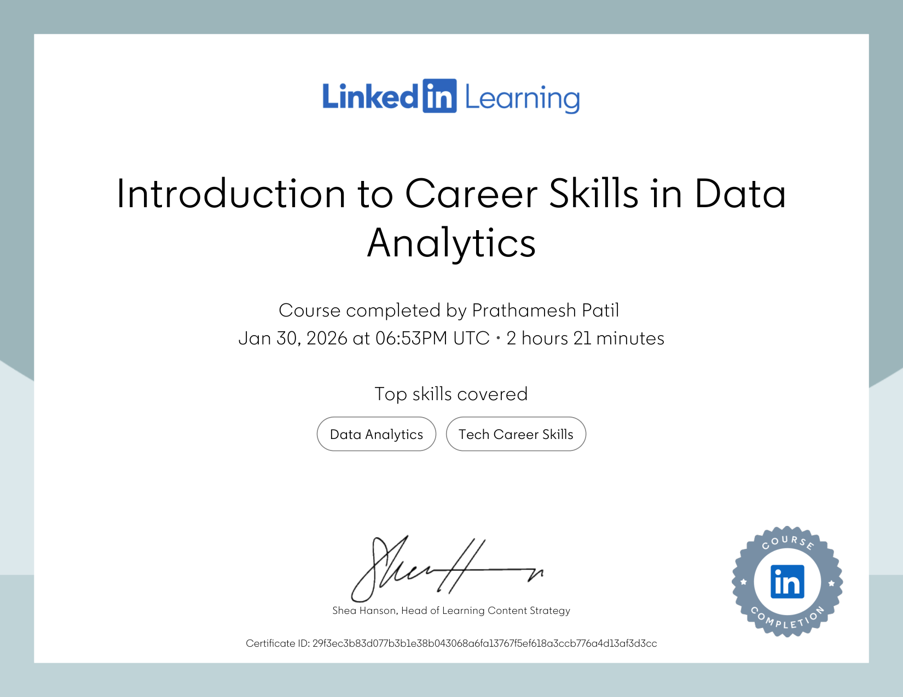](Microsoft/Microsoft_Introduction_to_Data_Analytics.pdf)

- **Certificate Name**: Introduction to Career Skills in Data Analytics
- **Issuing Organization**: Microsoft & LinkedIn
- **Year**: 2026
- **Skills Gained**: Acquired foundational data analytics, statistical analysis, and tech career competencies.

---

## 🟢 NVIDIA

### Applications of AI for Anomaly Detection
[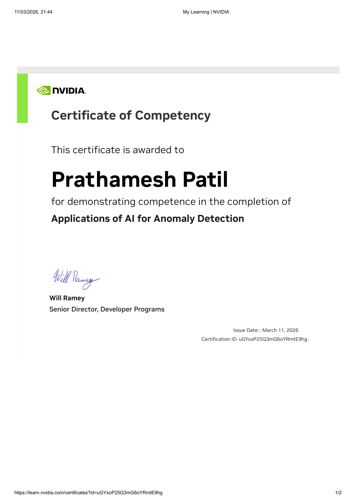](NVIDIA/NVIDIA_Applications_of_AI_for_Anomaly_Detection.pdf)

- **Certificate Name**: Applications of AI for Anomaly Detection
- **Issuing Organization**: NVIDIA Deep Learning Institute (DLI)
- **Year**: 2026
- **Skills Gained**: Learned deep learning techniques for computer vision and time-series anomaly detection.

---

### Fundamentals of Deep Learning
[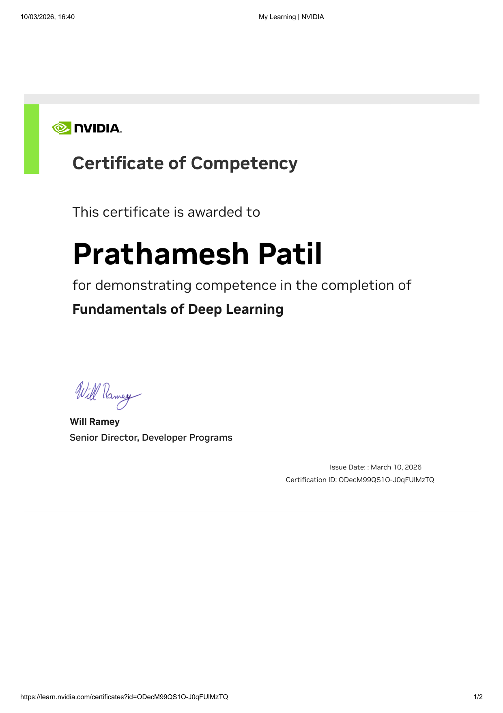](NVIDIA/NVIDIA_Fundamentals_of_Deep_Learning.pdf)

- **Certificate Name**: Fundamentals of Deep Learning
- **Issuing Organization**: NVIDIA Deep Learning Institute (DLI)
- **Year**: 2026
- **Skills Gained**: Built, trained, and deployed deep neural networks for computer vision and NLP using PyTorch.

---

## 🔵 IBM

### IBM Granite Models for Software Development
[![IBM Granite Models for Software Development]

- **Certificate Name**: IBM Granite Models for Software Development
- **Issuing Organization**: IBM SkillsBuild
- **Year**: 2026
- **Skills Gained**: Leveraged IBM Granite open LLMs for code generation, refactoring, and AI pair programming.

---

### Generative AI: From Prompt to Production
[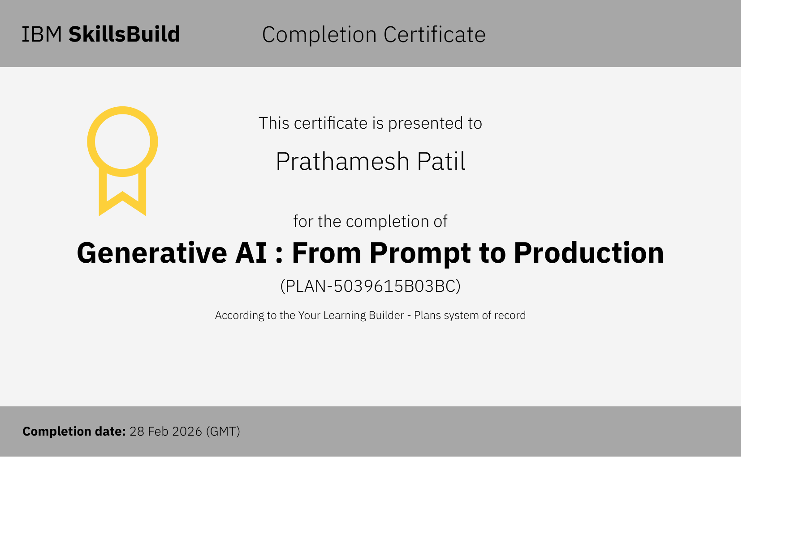](IBM/IBM_Generative_AI_Prompt_to_Production.pdf)

- **Certificate Name**: Generative AI: From Prompt to Production
- **Issuing Organization**: IBM SkillsBuild
- **Year**: 2026
- **Skills Gained**: Mastered prompt engineering, GenAI architectures, and deploying LLMs to production pipelines.

---

### Introduction to Large Language Models (LLMs)
[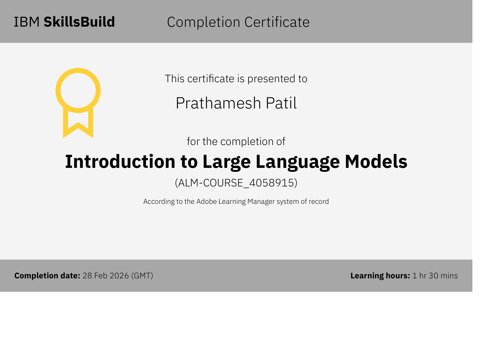](IBM/IBM_Introduction_to_Large_Language_Models.pdf)

- **Certificate Name**: Introduction to Large Language Models (LLMs)
- **Issuing Organization**: IBM SkillsBuild
- **Year**: 2026
- **Skills Gained**: Understood transformer neural networks, pre-training, fine-tuning, and LLM capabilities.

---

### Intelligent by Design: Build an AI Agent
[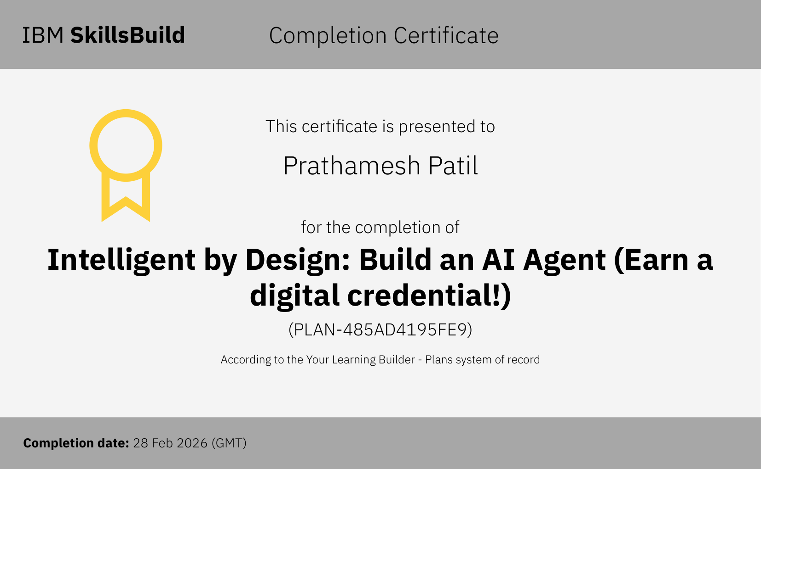](IBM/IBM_Build_an_AI_Agent.pdf)

- **Certificate Name**: Intelligent by Design: Build an AI Agent
- **Issuing Organization**: IBM SkillsBuild
- **Year**: 2026
- **Skills Gained**: Designed autonomous AI agents capable of multi-step reasoning and dynamic tool execution.

---

### Use Generative AI for Software Development
[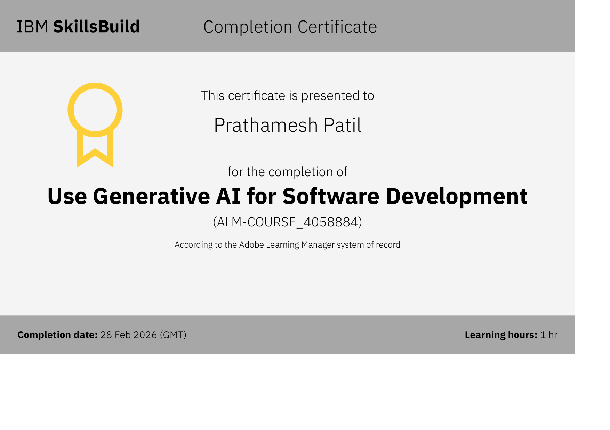](IBM/IBM_Generative_AI_for_Software_Development.pdf)

- **Certificate Name**: Use Generative AI for Software Development
- **Issuing Organization**: IBM SkillsBuild
- **Year**: 2026
- **Skills Gained**: Applied generative AI tools to accelerate software engineering and automated debugging.

---

## 🟡 Google for Developers

### Google Analytics Certification
[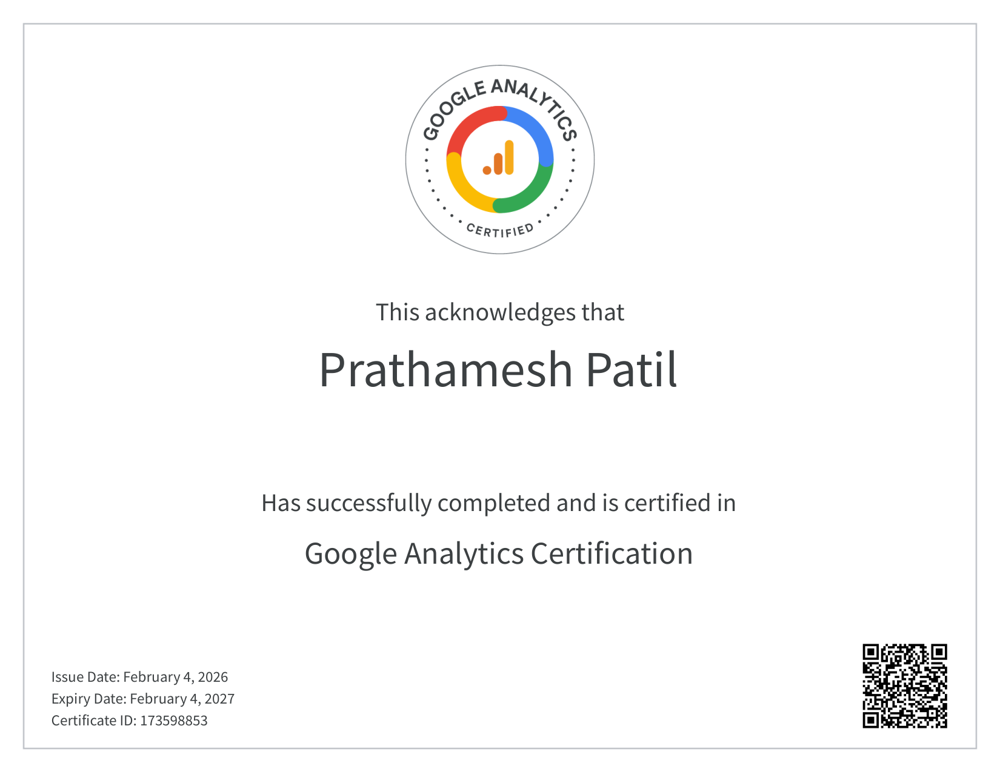](Google/Google_Analytics_Certification.pdf)

- **Certificate Name**: Google Analytics Certification
- **Issuing Organization**: Google
- **Year**: 2026
- **Skills Gained**: Demonstrated proficiency in Google Analytics 4 (GA4), web tracking, conversion metrics, and audience reporting.

---

## 🟢 Deloitte

### Data Analytics Job Simulation
[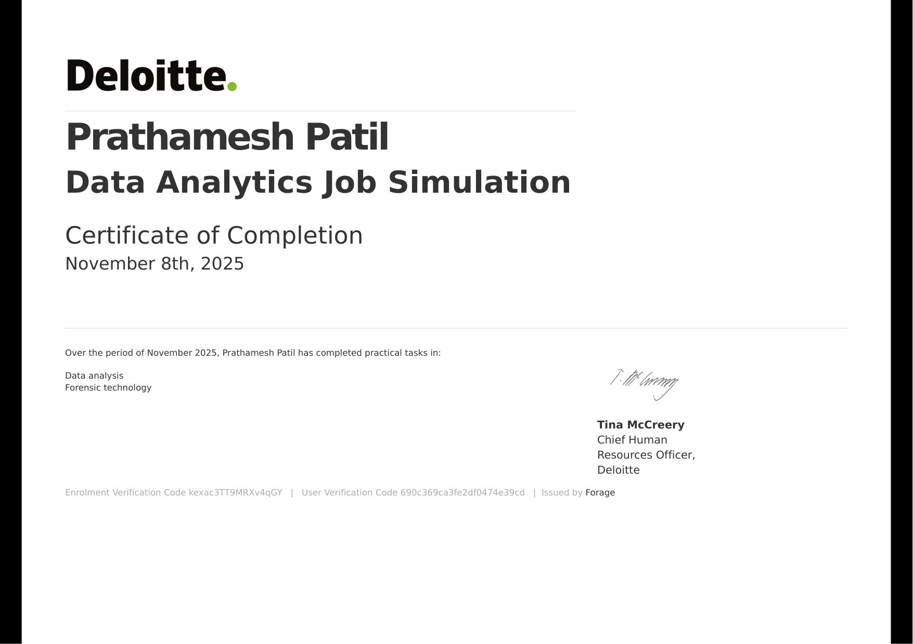](Deloitte/Deloitte_Data_Analytics_Job_Simulation.pdf)

- **Certificate Name**: Data Analytics Job Simulation
- **Issuing Organization**: Deloitte (via Forage)
- **Year**: 2025
- **Skills Gained**: Performed forensic technology analysis and data analytics to extract actionable business insights.

---

## 🎓 AICTE & EduSkills

### AICTE-EduSkills Virtual Internship Certification
[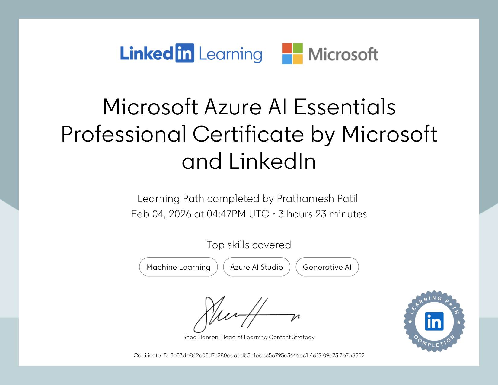](AICTE-EduSkills/AICTE_EduSkills_Virtual_Internship.pdf)

- **Certificate Name**: AICTE-EduSkills Virtual Internship Certification
- **Issuing Organization**: AICTE & EduSkills Foundation
- **Year**: 2025
- **Skills Gained**: Completed hands-on technical training and virtual internship in Cloud & AI Technologies.

---

## 🏆 Other Certifications

### BCG GenAI Job Simulation
[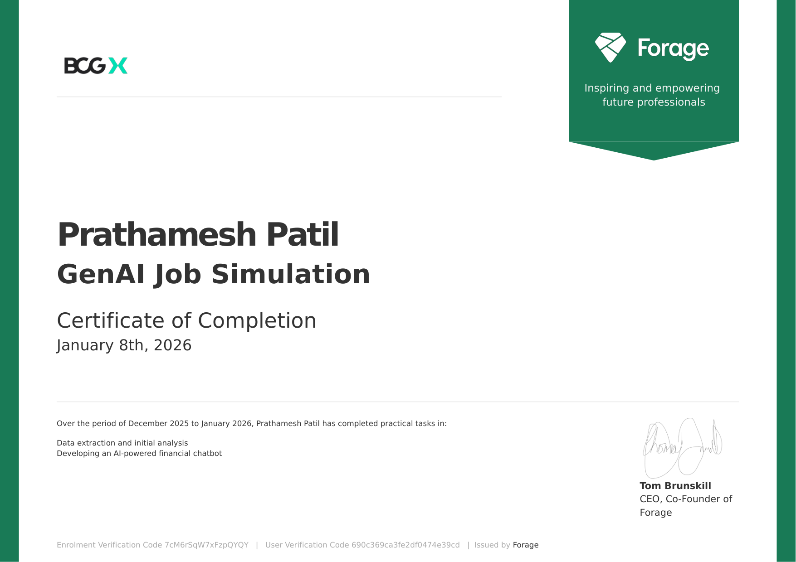](Other/BCG_GenAI_Job_Simulation.pdf)

- **Certificate Name**: GenAI Job Simulation
- **Issuing Organization**: Boston Consulting Group (BCG) (via Forage)
- **Year**: 2026
- **Skills Gained**: Extracted financial data and developed an AI-powered financial chatbot.

---

### Tata GenAI Powered Data Analytics Simulation
[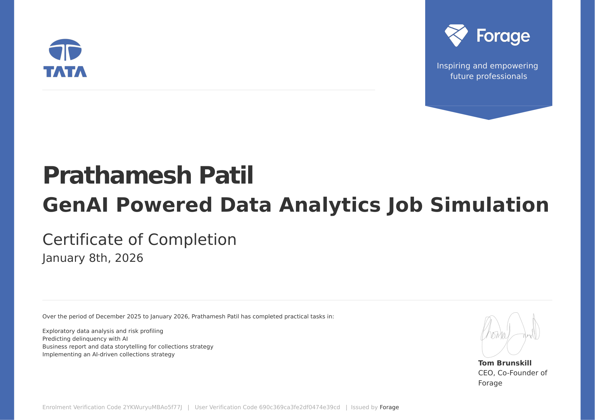](Other/Tata_GenAI_Data_Analytics_Simulation.pdf)

- **Certificate Name**: GenAI Powered Data Analytics Job Simulation
- **Issuing Organization**: Tata Group (via Forage)
- **Year**: 2026
- **Skills Gained**: Applied AI to risk profiling, predictive delinquency modeling, and collections strategy.

---

### Tata Data Visualisation Job Simulation
[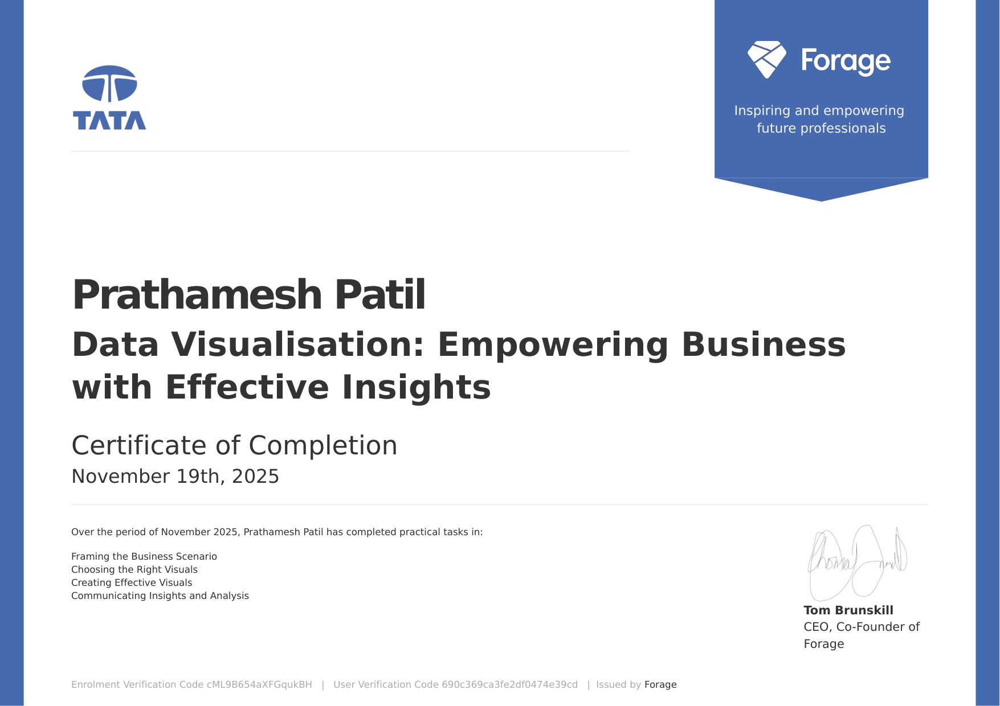](Other/Tata_Data_Visualisation_Simulation.pdf)

- **Certificate Name**: Data Visualisation: Empowering Business with Effective Insights
- **Issuing Organization**: Tata Group (via Forage)
- **Year**: 2025
- **Skills Gained**: Framed business scenarios and designed executive data visualizations and insights.

---

### GCE Karad TechSprint Hackathon Certificate
[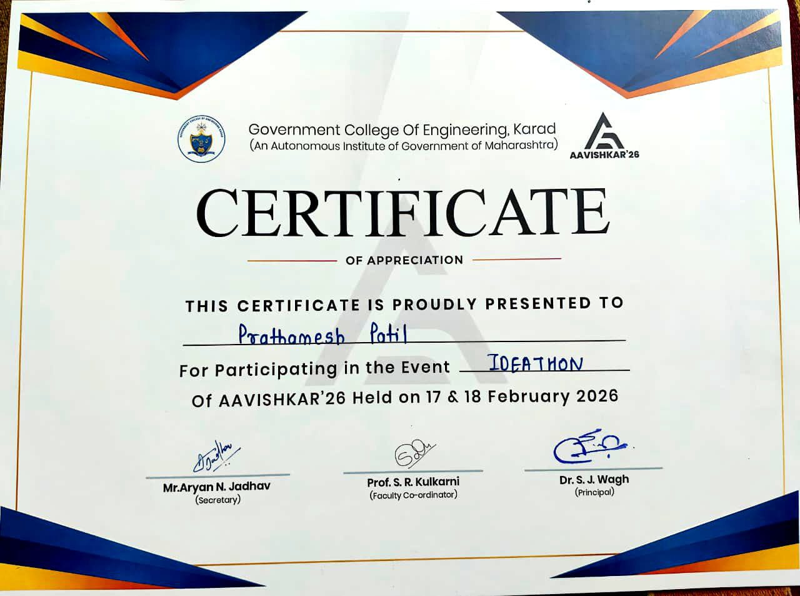](Other/GCE_Karad_Hackathon_Participation.jpeg)

- **Certificate Name**: GCE Karad TechSprint Hackathon Certificate
- **Issuing Organization**: Government College of Engineering (GCE Karad)
- **Year**: 2026
- **Skills Gained**: Participated in national-level engineering hackathon building AI & web applications.

---

## 👤 Author

**Shree Patil**
- 🐙 GitHub: [@Shree0802](https://github.com/Shree0802)
- 📧 Email: [shreepatil0802@gmail.com](mailto:shreepatil0802@gmail.com)
